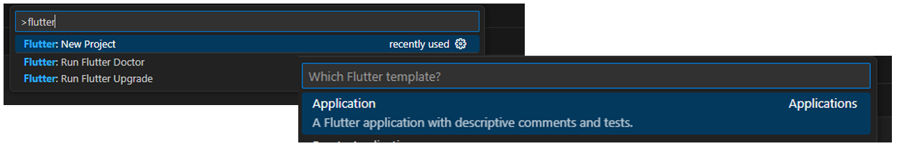
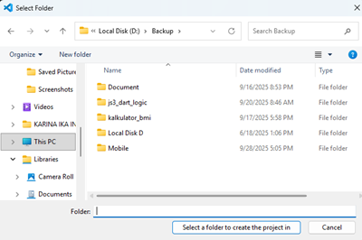
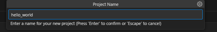
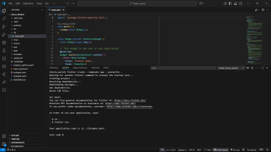

# 📱 Laporan Praktikum Pemrograman Mobile  

## Jobsheet 4 Flutter 1: Aplikasi Pertama dan Widget Dasar Flutter  

---

## 🙋‍♀️ Identitas  
- **Nama**  : Karina Ika Indasa  
- **NIM**   : 2341760042  
- **Kelas** : SIB-3C  
- **Mata Kuliah** : Pemrograman Mobile  

---

## 🎯 Tujuan Praktikum  
1. Mengenal struktur dasar project Flutter.  
2. Mampu membuat aplikasi pertama menggunakan Flutter.  
3. Memahami dan menggunakan widget dasar pada Flutter. 
4. Menjalankan aplikasi pada perangkat fisik (Android/iOS). 

---

## 🛠️ Alat dan Bahan
- **Hardware** : Laptop/PC dengan RAM minimal 8GB  
- **Software** :
  - Flutter SDK  
  - Android Studio / VS Code  
  - Emulator Android / Device Fisik  
- **Bahasa Pemrograman** : Dart  

--- 

## 📝 Langkah Praktikum  
### Praktikum 1: Membuat Project Flutter Baru
**Langkah 1:**
- Buka VS Code, lalu tekan tombol Ctrl + Shift + P maka akan tampil Command Palette, lalu ketik Flutter. Pilih New Application Project. 

  

**Langkah 2:**
- Kemudian buat folder sesuai style laporan praktikum yang Anda pilih. Disarankan pada folder dokumen atau desktop atau alamat folder lain yang tidak terlalu dalam atau panjang. Lalu pilih Select a folder to create the project in.

  

**Langkah 3:**
- Buat nama project flutter hello_world seperti berikut, lalu tekan Enter. Tunggu hingga proses pembuatan project baru selesai.

  

**Langkah 4:**
- Jika sudah selesai proses pembuatan project baru, pastikan tampilan seperti berikut. Pesan akan tampil berupa "Your Flutter Project is ready!" artinya Anda telah berhasil membuat project Flutter baru.

  